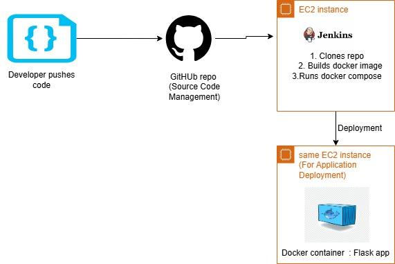
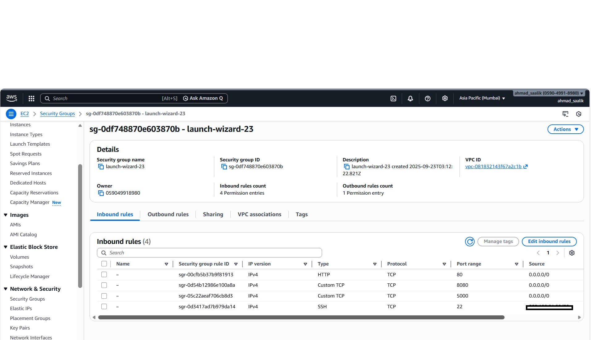

# weather_app_python
Weather app built with Flask and Python. Enter a city, get live temperature and conditions. The app is deployed to a EC2 server by a Jenkins Pipeline which pulls the code, containerizes the app as a Docker  container  and then deploys it using Docker compose.  

## Tech stack 
- *Frontend:* Flask, a lightweight Python web framework  
- *Devops Tools:* Jenkins, GitHub, Docker, Docker Compose
---  
## Table of Contents 
[Project Overview](#project-overview)  
[Architecture Diagram](#arch-diagram)  
[Step 1: AWS EC2 Instance Preparation](#ec2-prep)  
[Step 2: Install Dependencies on EC2](#dependency-installation-ec2)  
[Step 3: Jenkins Installation and Setup](#jenkins-installation)  
[Step 4: GitHub Repository Configuration](#github-repo)  
- [Dockerfile](#dockerfile)  
- [docker-compose.yml](#docker-compose)  
- [Jenkinsfile](#jenkinsfile)  
[Jenkins CI/CD pipeline](#jenkinspipeline)  
[Troubleshooting](#troubleshooting)    
[What problem does this project solve](#problemsolved)    
[Conclusion](#conclusion)  

## Project Overview
**Automated Flask CI/CD Pipeline on AWS EC2**  : Production-grade Flask app deployed via Jenkins on AWS EC2: GitHub push triggers build, Docker image creation, and seamless deployment using Docker compose. Demonstrates CI/CD, containerization, automation mastery for scalable cloud ops.  

## Architecture Diagram



---
## Step 1: AWS EC2 Instance Preparation  
- AMI: Ubuntu
- Attach a security group to restrict traffic
- Assign a keypair for SSH access


**Security Group**
Inbound rules
- Type: SSH, Protocol: TCP, Port: 22, Source: Your IP  
- Type: HTTP, Protocol: TCP, Port: 80, Source: Anywhere (0.0.0.0/0)  
- Type: Custom TCP, Protocol: TCP, Port: 5000 (for Flask), Source: Anywhere (0.0.0.0/0)  
- Type: Custom TCP, Protocol: TCP, Port: 8080 (for Jenkins), Source: Anywhere (0.0.0.0/0)


## Step 2: Install Dependencies on EC2  

**1. Installing Docker's official packages**
```sh
sudo apt-get update
sudo apt-get install ca-certificates curl gnupg lsb-release -y

sudo mkdir -p /etc/apt/keyrings
curl -fsSL https://download.docker.com/linux/ubuntu/gpg | sudo gpg --dearmor -o /etc/apt/keyrings/docker.gpg

echo \
  "deb [arch=$(dpkg --print-architecture) signed-by=/etc/apt/keyrings/docker.gpg] https://download.docker.com/linux/ubuntu \
  $(lsb_release -cs) stable" | sudo tee /etc/apt/sources.list.d/docker.list > /dev/null
```
**2. Installing Docker engine and the compose plugin**
```sh
sudo apt-get update
sudo apt-get install docker-ce docker-ce-cli containerd.io docker-buildx-plugin docker-compose-plugin -y
```
**3. Running Docker service**
```sh
sudo systemctl start docker
sudo systemctl enable docker
```
**4. Add User to Docker Group (to run docker without sudo):**

```sh
sudo usermod -aG docker $USER
```

## Step 3: Jenkins Installation and Setup

- **1. Installing Java JDK21**
  ```bash
  sudo apt update
  sudo apt install fontconfig openjdk-21-jre
  java -version
  ```
- **2. Installing Jenkins**
 ```bash
sudo wget -O /etc/apt/keyrings/jenkins-keyring.asc \
  https://pkg.jenkins.io/debian-stable/jenkins.io-2026.key
echo "deb [signed-by=/etc/apt/keyrings/jenkins-keyring.asc]" \
  https://pkg.jenkins.io/debian-stable binary/ | sudo tee \
  /etc/apt/sources.list.d/jenkins.list > /dev/null
sudo apt update
sudo apt install jenkins
```
- **3. Start and Enable Jenkins Service:**
```
sudo systemctl start jenkins
sudo systemctl enable jenkins
```
- **4. Initial Jenkins Setup:**

Retrieving  the initial admin password:
```
sudo cat /var/lib/jenkins/secrets/initialAdminPassword
```
Access the Jenkins dashboard at http://<ec2-public-ip>:8080.
Paste the password, install suggested plugins, and create an admin user.
- **5. Grant Jenkins Docker Permissions:**

```sudo usermod -aG docker jenkins
sudo systemctl restart jenkins
```


