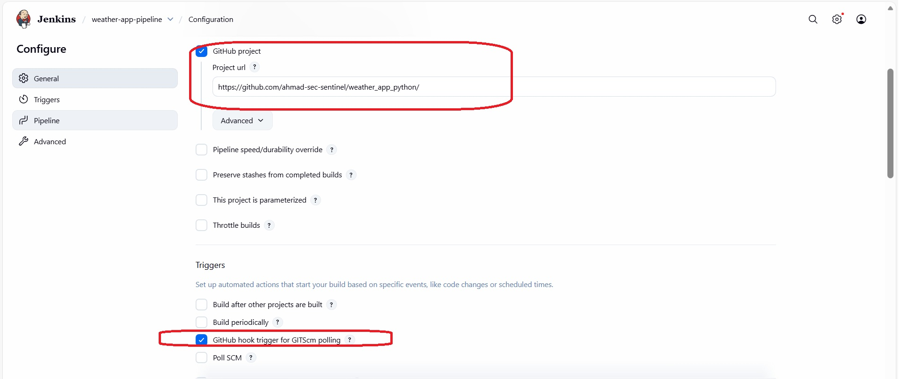
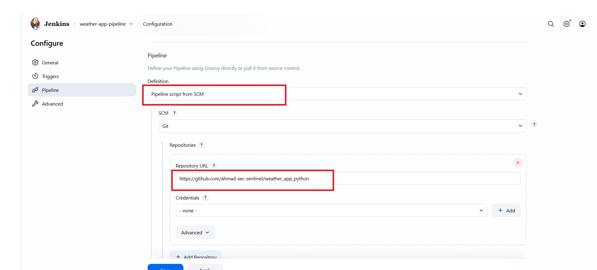
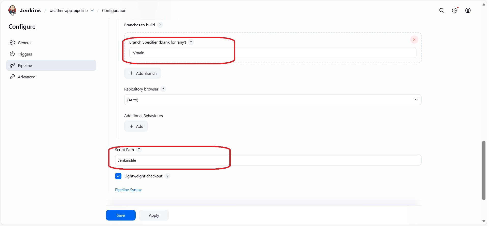
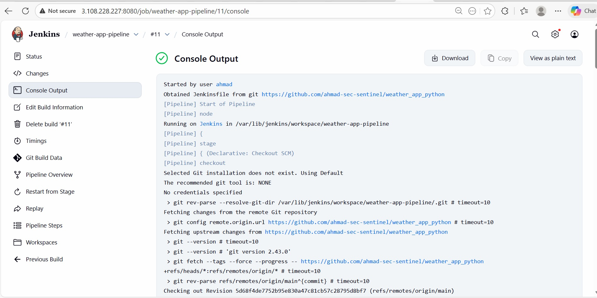
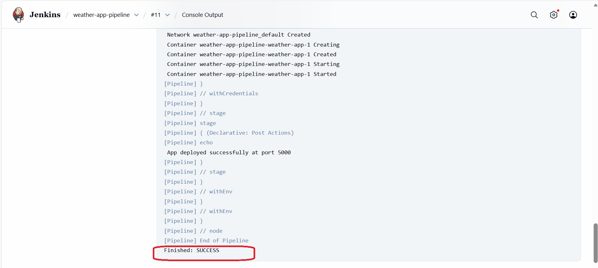
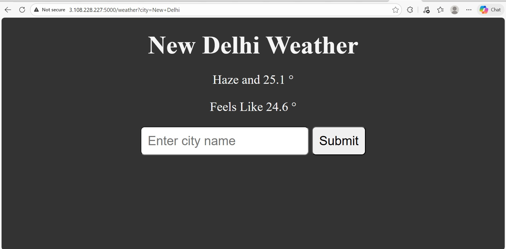

# weather_app_python
Weather app built with Flask and Python. Enter a city, get live temperature and conditions. The app is deployed to a EC2 server by a Jenkins Pipeline which pulls the code, containerizes the app as a Docker  container  and then deploys it using Docker compose.  

## Tech stack 
- *Frontend:* Flask, a lightweight Python web framework  
- *Devops Tools:* Jenkins, GitHub, Docker, Docker Compose
---  
## Table of Contents 
[Project Overview](#project-overview)  
[Architecture Diagram](#arch-diagram)  
[Step 1: AWS EC2 Instance Preparation](#ec2-prep)  
[Step 2: Install Dependencies on EC2](#dependency-installation-ec2)  
[Step 3: Jenkins Installation and Setup](#jenkins-installation)  
[Step 4: GitHub Repository Configuration](#github-repo)  
- [Dockerfile](#dockerfile)  
- [docker-compose.yml](#docker-compose)  
- [Jenkinsfile](#jenkinsfile)  
[Jenkins CI/CD pipeline](#jenkinspipeline)  
[Troubleshooting](#troubleshooting)    
[What problem does this project solve](#problemsolved)    
[Conclusion](#conclusion)  

## Project Overview
**Automated Flask CI/CD Pipeline on AWS EC2**  : Production-grade Flask app deployed via Jenkins on AWS EC2: GitHub push triggers build, Docker image creation, and seamless deployment using Docker compose. Demonstrates CI/CD, containerization, automation mastery for scalable cloud ops.  

## Architecture Diagram


---
## Step 1: AWS EC2 Instance Preparation  
- AMI: Ubuntu
- Attach a security group to restrict traffic
- Assign a keypair for SSH access


**Security Group**
Inbound rules
- Type: SSH, Protocol: TCP, Port: 22, Source: Your IP  
- Type: HTTP, Protocol: TCP, Port: 80, Source: Anywhere (0.0.0.0/0)  
- Type: Custom TCP, Protocol: TCP, Port: 5000 (for Flask), Source: Anywhere (0.0.0.0/0)  
- Type: Custom TCP, Protocol: TCP, Port: 8080 (for Jenkins), Source: Anywhere (0.0.0.0/0)


## Step 2: Install Dependencies on EC2  

**1. Installing Docker's official packages**
```sh
sudo apt-get update
sudo apt-get install ca-certificates curl gnupg lsb-release -y

sudo mkdir -p /etc/apt/keyrings
curl -fsSL https://download.docker.com/linux/ubuntu/gpg | sudo gpg --dearmor -o /etc/apt/keyrings/docker.gpg

echo \
  "deb [arch=$(dpkg --print-architecture) signed-by=/etc/apt/keyrings/docker.gpg] https://download.docker.com/linux/ubuntu \
  $(lsb_release -cs) stable" | sudo tee /etc/apt/sources.list.d/docker.list > /dev/null
```
**2. Installing Docker engine and the compose plugin**
```sh
sudo apt-get update
sudo apt-get install docker-ce docker-ce-cli containerd.io docker-buildx-plugin docker-compose-plugin -y
```
**3. Running Docker service**
```sh
sudo systemctl start docker
sudo systemctl enable docker
```
**4. Add User to Docker Group (to run docker without sudo):**

```sh
sudo usermod -aG docker $USER
```

## Step 3: Jenkins Installation and Setup

- **1. Installing Java JDK21**
  ```bash
  sudo apt update
  sudo apt install fontconfig openjdk-21-jre
  java -version
  ```
- **2. Installing Jenkins**
 ```bash
sudo wget -O /etc/apt/keyrings/jenkins-keyring.asc \
  https://pkg.jenkins.io/debian-stable/jenkins.io-2026.key
echo "deb [signed-by=/etc/apt/keyrings/jenkins-keyring.asc]" \
  https://pkg.jenkins.io/debian-stable binary/ | sudo tee \
  /etc/apt/sources.list.d/jenkins.list > /dev/null
sudo apt update
sudo apt install jenkins
```
- **3. Start and Enable Jenkins Service:**
```
sudo systemctl start jenkins
sudo systemctl enable jenkins
```
- **4. Initial Jenkins Setup:**

Retrieving  the initial admin password:
```
sudo cat /var/lib/jenkins/secrets/initialAdminPassword
```
Access the Jenkins dashboard at `http://<ec2-public-ip>:8080`.
Paste the password, install suggested plugins, and create an admin user.
- **5. Grant Jenkins Docker Permissions:**

```
sudo usermod -aG docker jenkins
sudo systemctl restart jenkins
```

## Step 4: GitHub Repository Configuration
**1. DockerFile**- It contains the list of intructions which is used to build a docker image
```
#Using official Python runtime as base image
FROM python:3.11-slim

# Setting the working directory in the container
WORKDIR /app

# Copying the file which has list of dependencies
COPY requirements.txt .

# Installing the dependencies listed in the requirements.txt file
RUN pip install -r requirements.txt

# Copying rest of the application code
COPY . .

# Mentioning the port that will be exposed when the container runs
EXPOSE 5000

# Command to run the application
CMD ["python", "server.py"]
```
**2. docker-compose.yml**
```
services:
  weather-app:
    image: ${IMAGE_NAME}:${IMAGE_TAG}
    ports:
      - "5000:5000"   # mapped to avoid Jenkins port conflict
    environment:
      - API_KEY=${API_KEY}   #API_KEY is stored as a secret credential inside Jenkins.This ensures safety of API_KEY
    restart: unless-stopped
```
**3. Jenkinsfile**
```
pipeline {
  agent any

  environment {
    IMAGE_NAME = "ahmaddocknroll/weather-app"
    IMAGE_TAG  = "${env.BUILD_NUMBER}"
    APP_PORT   = "5000"   
  }


  stages {

    stage('Checkout') {
      steps {
        checkout scm
      }
    }

    stage('Build Docker image') {
      steps {
        sh '''
          docker build -t ${IMAGE_NAME}:${IMAGE_TAG} .
        '''
      }
    }

    stage('Push image to Docker Hub') {
      steps {
        withCredentials([usernamePassword(credentialsId: 'dockerhub-creds', usernameVariable: 'DOCKER_USER', passwordVariable: 'DOCKER_PASS')]) {
          sh '''
            echo "$DOCKER_PASS" | docker login -u "$DOCKER_USER" --password-stdin
            docker push ${IMAGE_NAME}:${IMAGE_TAG}
          '''
        
        }
      }
    }

    stage('Deploy with Docker Compose') {
      steps {
        withCredentials([string(credentialsId: 'openweather-api-key', variable: 'API_KEY')]){
        sh '''
          export IMAGE_NAME=${IMAGE_NAME}
          export IMAGE_TAG=${IMAGE_TAG}
          export API_KEY=${API_KEY}
          docker compose down
          docker compose up -d
        '''
        }
      }
    }
  }

  post {
    success {
      echo " App deployed successfully at port ${APP_PORT}"
    }
    failure {
      echo " Deployment failed. Check logs for details."
    }
  }
}
```

---
## Jenkins CI/CD pipeline
**1. Creating a new item**
- Click on New Item. Give a name for the item, select Pipeline and then click on OK.
**2. Configure the Pipeline:**
- We select Github Project and give the URL link to the repo.
- Under Triggers we select Github hook trigger.

- Under the pipeline section, select definition as Pipeline script from SCM
- Set SCM as Git and give the URL of the Github repository.

- Verify the Script Path is Jenkinsfile.
- Save the configuration.

**3. Creating a webhook on Github associated with the repo**

**4. Run the Pipeline:**
- Click Build Now to trigger the pipeline manually for the first time.  
- From the navigation panel o left, the status of build can be seen by clicking on Console Output.



**5.Verify Deployment:**
- After a successful build, the Flask application will be accessible at `http://<ec2-public-ip>:5000`




- Confirm the containers are running on the EC2 instance with docker ps


## Troubleshooting

**1. Storing the API key**  
This weather app uses API key. Inorder to ensure its safety , I used these measures.  
- While pushing the code from my local to Github, I put the .env file having the API key under gitignore.  
- To prevent hardcoding the API_KEY , I saved it as secret  Credentials inside Jenkins and later referred to it in my Jenkinsfile.  
- API_KEY is passed via Jenkins credentials to  Docker Compose which then passes it into container environment.  
  
**2. Storing Docker hub credentials**  
I stored this also as secret  Credentials inside Jenkins.  

**3. Case mismatch**  
In my weather.py Python file and the Jenkinsfile there was a case  mismatch between the variable for API KEY. I rectified it by ensuring there is case uniformity at both the places else the API call would fail.  

**4. Error handling**  

While excuting the build, I got an error message :"ERROR: Cannot connect to the Docker daemon at unix:///var/run/docker.sock. Is the docker daemon running?"  

**How I rectified the error----**  
- Started Docker daemon (`systemctl start docker`).  
- Added Jenkins user to docker group (`usermod -aG docker jenkins`).  
- Restarted Jenkins `sudo systemctl restart jenkins`

**5. Resolved a Docker Compose version mismatch by upgrading to v2 and removing deprecated syntax.**  
- Docker Compose v2 is now part of the Docker CLI as docker compose (note: no hyphen).  
- In the earlier version of docker compose we needed to mention `version: '3.8' at the beginning of our YAML File but Docker Compose v2 no longer requires it and will ignore it anyway.


`


